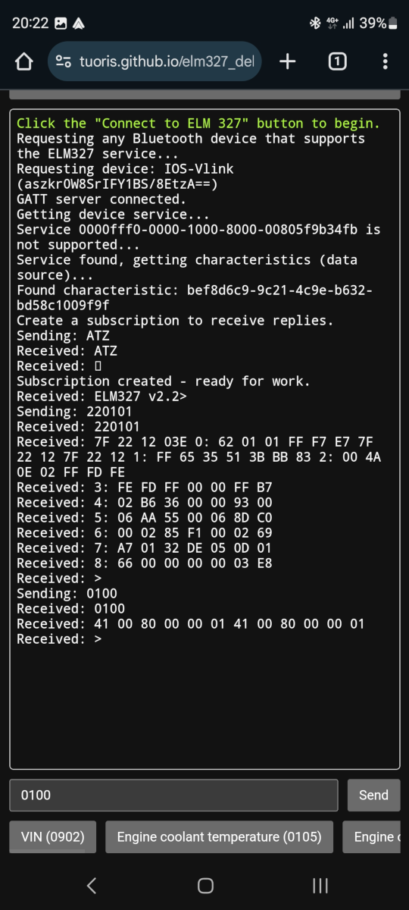

# ELM 327 Bluetooth app

## Communicate with ELM 327 via Web Bluetooth API

The app is available here: https://tuoris.github.io/elm327_debugger/en/

Ukrainian version: https://tuoris.github.io/elm327_debugger/

## UI

### Reading Hyundai Kona/Kia Niro data

## Thanks

Hyundai Kona/Kia Niro data parsing is references from Open-Vehicle-Monitoring-System-3 (OVMS3) code:

https://github.com/openvehicles/Open-Vehicle-Monitoring-System-3/blob/master/vehicle/OVMS.V3/components/vehicle_kianiroev/src/vehicle_kianiroev.cpp#L83

and Kia e-Niro Can messages investigation spreadsheet:

https://docs.google.com/spreadsheets/d/1eT2R8hmsD1hC__9LtnkZ3eDjLcdib9JR-3Myc97jy8M
